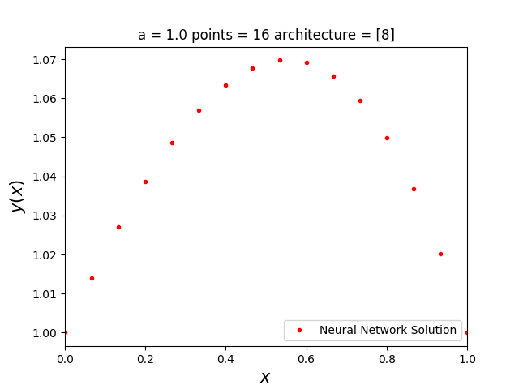
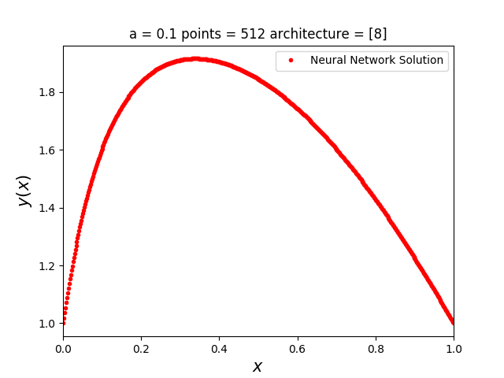
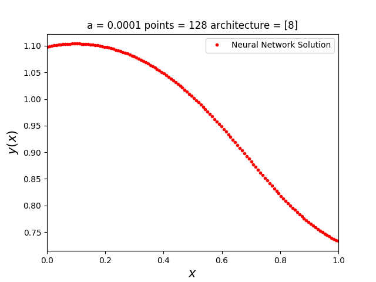

##  Results for a = 1
  
  
| a   | b     | points | architecture | difference             | Working |
|-----|-------|--------|:------------:|------------------------|:-------:|
| 1.0 | 1e-12 | 16     |      [8]     | 1.4407478467592938e-05 |   Yes   |
| 1.0 | 1e-12 | 32     |      [8]     | 1.7663427669845078e-05 |   Yes   |
| 1.0 | 1e-12 | 64     |      [8]     | 1.8176861469987315e-05 |   Yes   |
| 1.0 | 1e-12 | 128    |      [8]     | 2.5106978866151763e-05 |   Yes   |
| 1.0 | 1e-12 | 256    |      [8]     | -8.74193778608312e-05  |   Yes   |
| 1.0 | 1e-12 | 512    |      [8]     | 1.757968668647525e-05  |   Yes   |
| 1.0 | 1e-12 | 1024   |      [8]     | 1.8365182426371973e-05 |   Yes   |
| 1.0 | 1e-12 | 2048   |      [8]     | 0.0001786772933216607  |   Yes   |
| 1.0 | 1e-12 | 4096   |      [8]     | 2.44829418791781e-05   |   Yes   |
  

  
##  Results for a = 0.1
  
  
| a   | b     | points | architecture | difference             | Working |
|-----|-------|--------|:------------:|------------------------|:-------:|
| 0.1 | 1e-12 | 16   | [8] | 0.0002841575022904941 | Yes |
| 0.1 | 1e-12 | 32   | [8] | 0.0016514286291063884 | Yes |
| 0.1 | 1e-12 | 64   | [8] | 0.001955711652754988  | Yes |
| 0.1 | 1e-12 | 128  | [8] | 0.0013596781841742622 | Yes |
| 0.1 | 1e-12 | 256  | [8] | 0.001843387845756439  | Yes |
| 0.1 | 1e-12 | 512  | [8] | 0.0012382660894781905 | Yes |
| 0.1 | 1e-12 | 1024 | [8] | 0.0008127999771383454 | Yes |
| 0.1 | 1e-12 | 2048 | [8] | 0.0013807286088813875 | Yes |
| 0.1 | 1e-12 | 4096 | [8] | 0.0013872051050648482 | Yes |
  

  
##  Results for a = 1e-2
  
  
| a   | b     | points | architecture | difference             | Working |
|-----|-------|--------|:------------:|------------------------|:-------:|
| 0.01 | 1e-12 | 16   | [16, 16] | 3.648082766093913     | No |
| 0.01 | 1e-12 | 32   | [16, 16] | 3.7657684254301933    | No |
| 0.01 | 1e-12 | 64   | [16, 16] | 0.003455331412143603  | Yes |
| 0.01 | 1e-12 | 128  | [16, 16] | 0.0011111632772080604 | Yes |
| 0.01 | 1e-12 | 256  | [16, 16] | 0.0011528078780855266 | Yes |
| 0.01 | 1e-12 | 512  | [16, 16] | 0.0012124003162249375 | Yes |
| 0.01 | 1e-12 | 1024 | [16, 16] | 0.0011605214654138996 | Yes |
| 0.01 | 1e-12 | 2048 | [16, 16] | 0.0011410002249104267 | Yes |
| 0.01 | 1e-12 | 4096 | [16, 16] | 0.00131647681719671   | Yes |
  

  
##  Best Results for a = 1e-4
  
  
| a   | b     | points | architecture | difference             | Working |
|-----|-------|--------|:------------:|------------------------|:-------:|
| 0.0001 | 1e-12 | 16   | [16, 16] | nan | No |
| 0.0001 | 1e-12 | 32   | [16, 16] | nan | No |
| 0.0001 | 1e-12 | 64   | [16, 16] | nan | No |
| 0.0001 | 1e-12 | 128  | [16, 16] | nan | No |
| 0.0001 | 1e-12 | 256  | [16, 16] | nan | No |
| 0.0001 | 1e-12 | 512  | [16, 16] | nan | No |
| 0.0001 | 1e-12 | 1024 | [16, 16] | nan | No |
| 0.0001 | 1e-12 | 2048 | [16, 16] | nan | No |
| 0.0001 | 1e-12 | 4096 | [16, 16] | nan | No |
  
| a   | b     | points | architecture | difference             | Working |
|-----|-------|--------|:------------:|------------------------|:-------:|
| 0.0001 | 1e-12 | 16   | [32, 32, 32, 32] | nan | No |
| 0.0001 | 1e-12 | 32   | [32, 32, 32, 32] | nan | No |
| 0.0001 | 1e-12 | 64   | [32, 32, 32, 32] | nan | No |
| 0.0001 | 1e-12 | 128  | [32, 32, 32, 32] | nan | No |
| 0.0001 | 1e-12 | 256  | [32, 32, 32, 32] | nan | No |
| 0.0001 | 1e-12 | 512  | [32, 32, 32, 32] | nan | No |
| 0.0001 | 1e-12 | 1024 | [32, 32, 32, 32] | nan | No |
| 0.0001 | 1e-12 | 2048 | [32, 32, 32, 32] | nan | No |
| 0.0001 | 1e-12 | 4096 | [32, 32, 32, 32] | nan | No |
  

  
##  Best Results for a = 1e-8
  
  
| a   | b     | points | architecture | difference             | Working |
|-----|-------|--------|:------------:|------------------------|:-------:|
| 0.0001 | 1e-12 | 16   | [32, 32, 32, 32] | nan | No |
| 0.0001 | 1e-12 | 32   | [32, 32, 32, 32] | nan | No |
| 0.0001 | 1e-12 | 64   | [32, 32, 32, 32] | nan | No |
| 0.0001 | 1e-12 | 128  | [32, 32, 32, 32] | nan | No |
| 0.0001 | 1e-12 | 256  | [32, 32, 32, 32] | nan | No |
| 0.0001 | 1e-12 | 512  | [32, 32, 32, 32] | nan | No |
| 0.0001 | 1e-12 | 1024 | [32, 32, 32, 32] | nan | No |
| 0.0001 | 1e-12 | 2048 | [32, 32, 32, 32] | nan | No |
| 0.0001 | 1e-12 | 4096 | [32, 32, 32, 32] | nan | No |
  
| a   | b     | points | architecture | difference             | Working |
|-----|-------|--------|:------------:|------------------------|:-------:|
| 0.0001 | 1e-12 | 16   | [64, 64, 64, 64, 64, 64, 64, 64] | nan | No |
| 0.0001 | 1e-12 | 32   | [64, 64, 64, 64, 64, 64, 64, 64] | nan | No |
| 0.0001 | 1e-12 | 64   | [64, 64, 64, 64, 64, 64, 64, 64] | nan | No |
| 0.0001 | 1e-12 | 128  | [64, 64, 64, 64, 64, 64, 64, 64] | nan | No |
| 0.0001 | 1e-12 | 256  | [64, 64, 64, 64, 64, 64, 64, 64] | nan | No |
| 0.0001 | 1e-12 | 512  | [64, 64, 64, 64, 64, 64, 64, 64] | nan | No |
| 0.0001 | 1e-12 | 1024 | [64, 64, 64, 64, 64, 64, 64, 64] | nan | No |
| 0.0001 | 1e-12 | 2048 | [64, 64, 64, 64, 64, 64, 64, 64] | nan | No |
| 0.0001 | 1e-12 | 4096 | [64, 64, 64, 64, 64, 64, 64, 64] | nan | No |
  

  