## A = 1 B = 1e-12 Epochs = 50000 Architecture = [8]

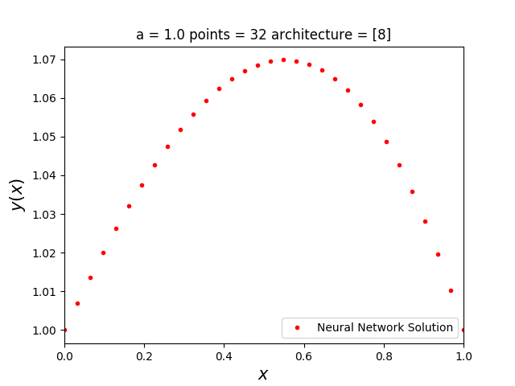
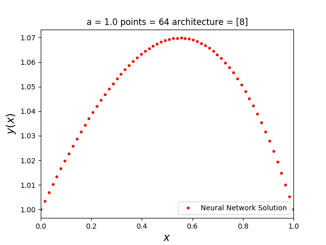
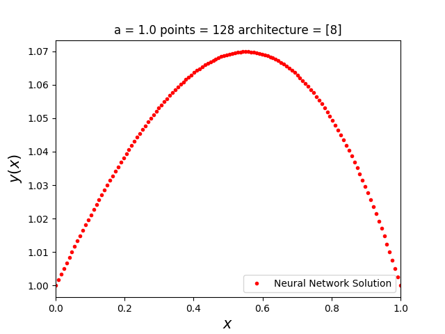

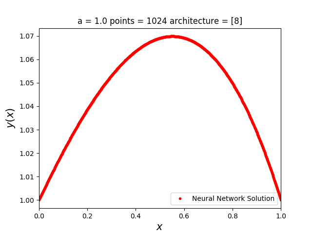

## A = 0.1 B = 1e-12 Epochs = 50000 Architecture = [8]

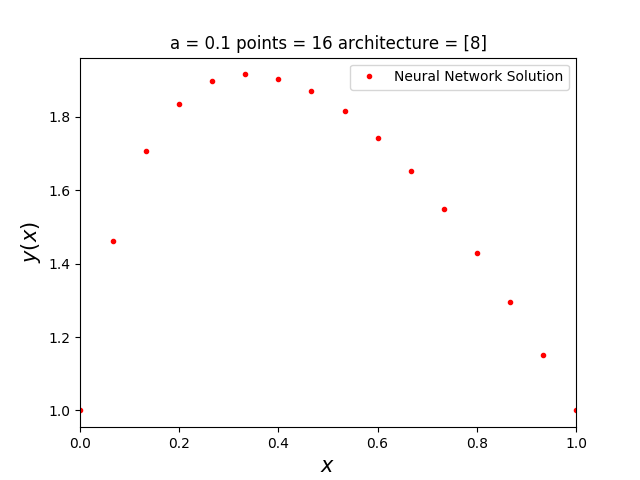

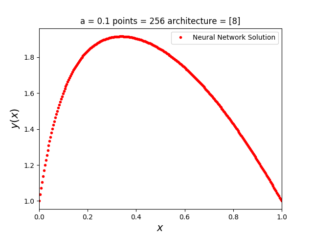

## A = 0.01 B = 1e-12 Epochs = 50000 Architecture = [8]

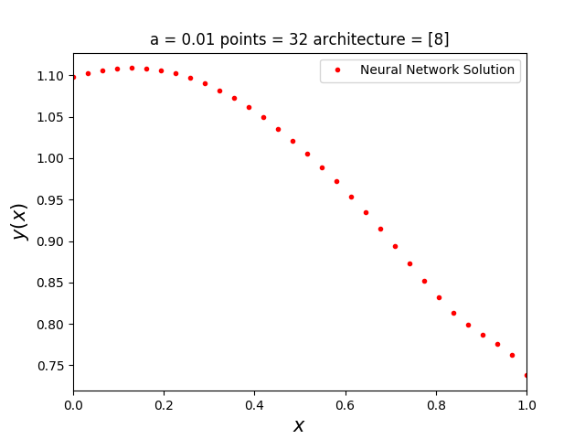
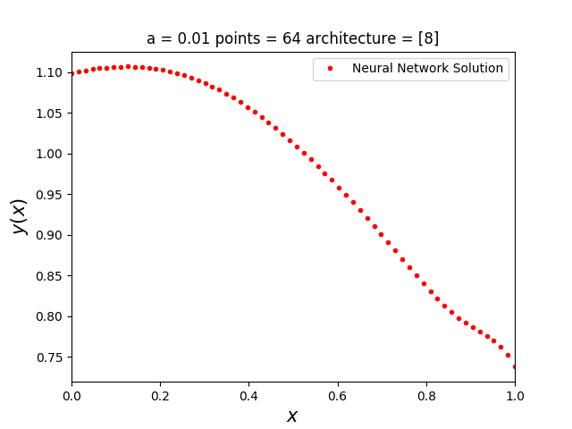

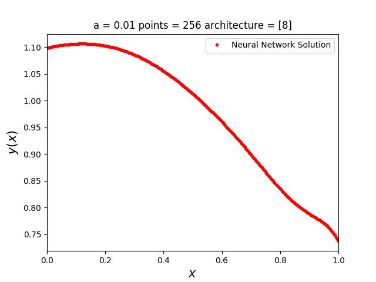

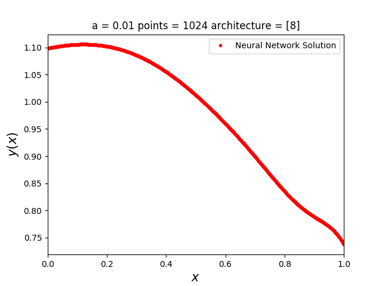

## A = 0.0001 B = 1e-12 Epochs = 50000 Architecture = [8]

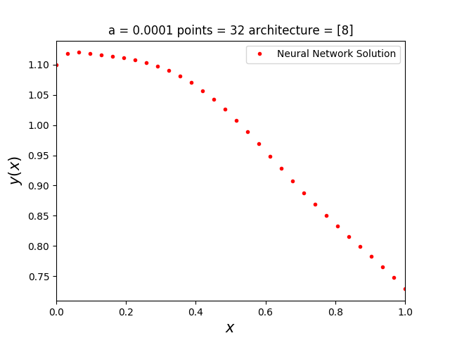
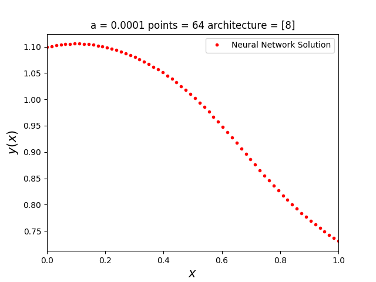

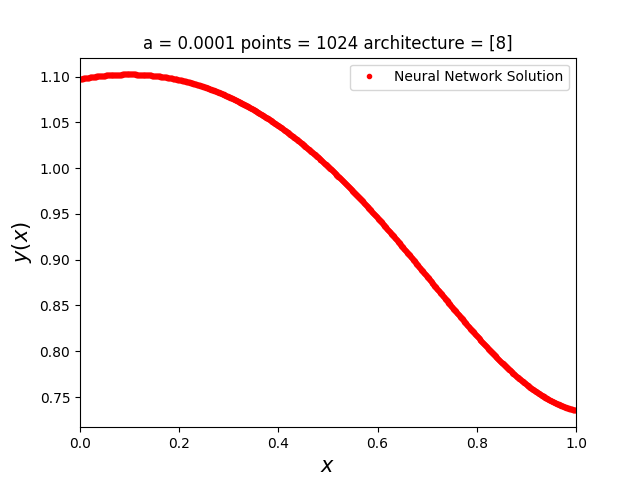

